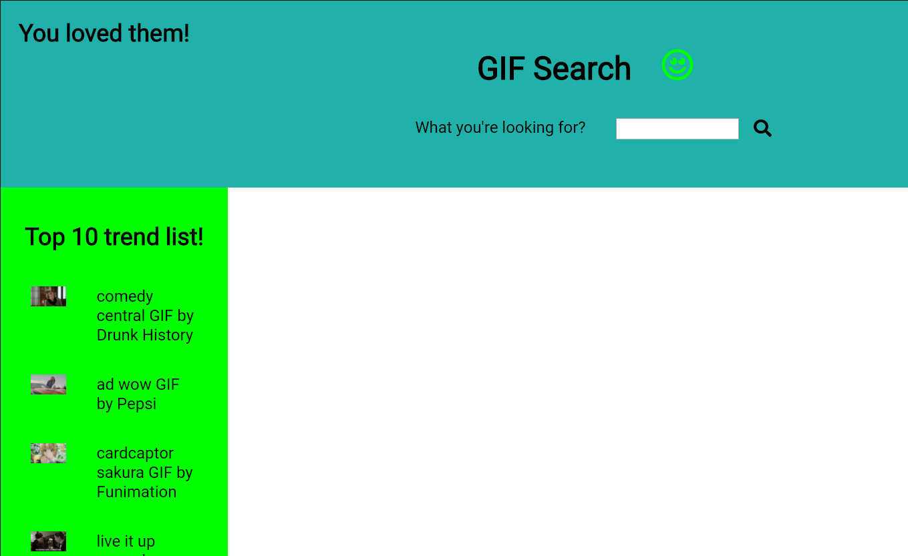
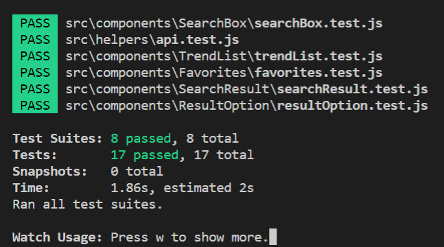

# Simple SPA for GIF search
Well... this is colorful! Keep it fun, like a GIF should be :)

## Status

## Quick start

- Clone the repo: `git clone https://github.com/npattarone/spa-gif-search.git`
- Install all dependencies [npm](https://www.npmjs.com/): `npm install`
- Run it with: `npm start`
- Go to your favorite browser and navigate to : `http://localhost:3000`
- Happy GIF Search!

## How to use it

At first sight, you will be seeing a top 10 trending list on the left, and on the header a space to search for GIFs and at it is left, you will find a list of Favorite GIFs that you would be able to add once found them. 

1)  Type anything you like on input search space
  - You can hit "Enter" or press the icon search to launch the search
2) You will see a result of top 20 (or less) GIFs that matches your search
  - You can click on any image to open it on a new Tab
  - Also, you will see a little hearth wich can be pressed and it will turn it to red to make this GIF a new favorite one
3) If you added a Favorite, you will see it at the top left of the page, inside header
- You can add o remove this by clicking on the little cross button on the right of each favorite GIF, or if you find it again through another search, by clicking the red heart which will turn into a gray one (not longer a favorite) 

## Test

1) Open a command line window
2) Navigate until your cloned folder location
3) Run the command [npm](https://www.npmjs.com/): `npm test`
4) You should see something like this:

5) You are free to add more or change them to improve coverage 

## Contact 

- Natalia Pattarone
- nataliapattarone@gmail.com
- Skype ID: natalia.pattarone